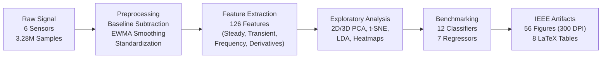
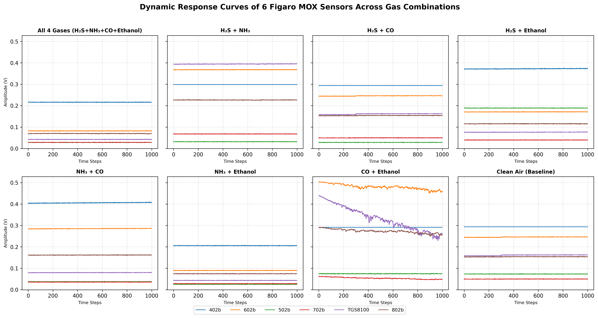
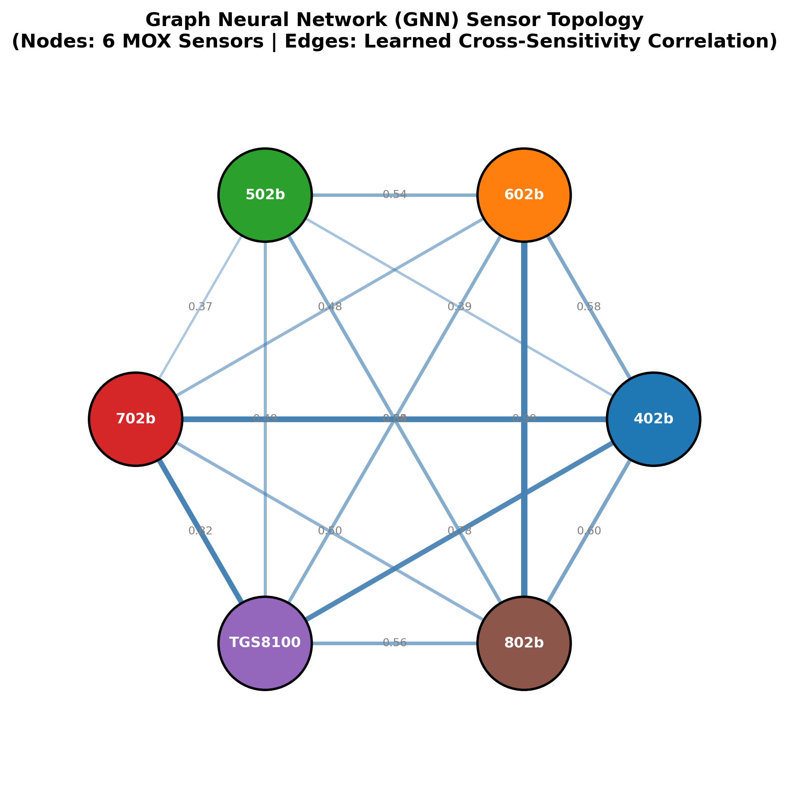
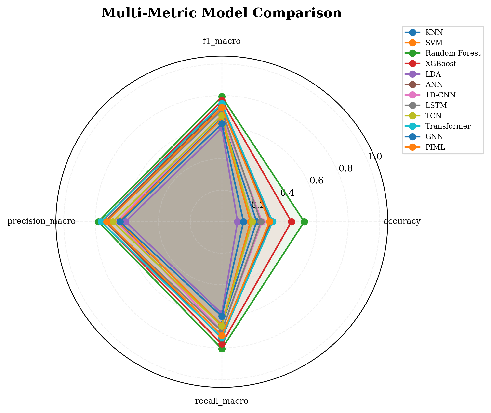
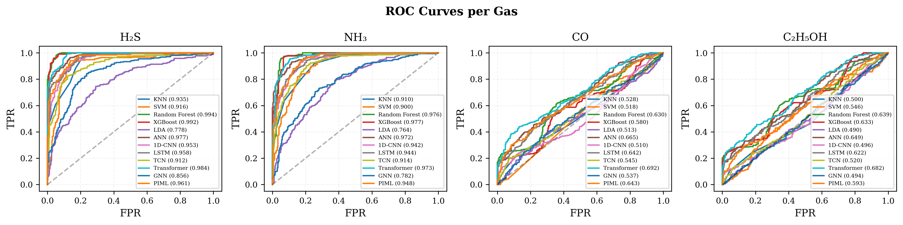
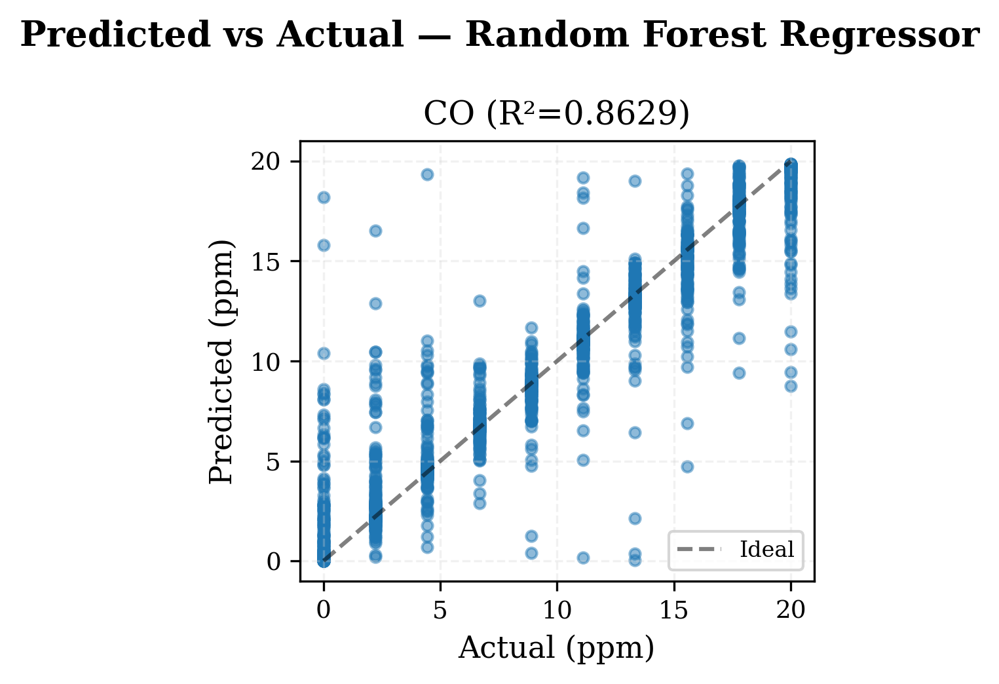
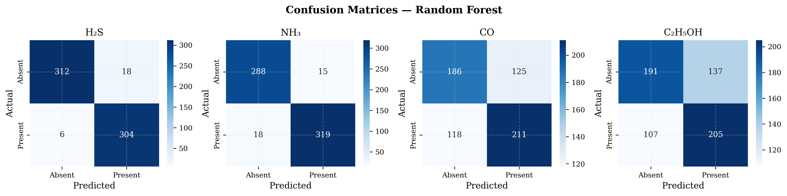

# Electronic Nose (E-Nose) Research: Multi-Gas Identification & Continuous Concentration Estimation

[](https://www.python.org/)
[](https://pytorch.org/)
[](https://scikit-learn.org/)
[]()

A comprehensive machine learning and deep learning research pipeline for multi-label gas mixture identification ($\text{NH}_3$, $\text{H}_2\text{S}$, $\text{CO}$, $\text{C}_2\text{H}_5\text{OH}$) and continuous concentration regression using Metal Oxide Semiconductor (MOX) sensor arrays.

---

## 🔬 Research Overview

This repository implements the complete academic pipeline following the sequence:
$$\text{Raw MOX Signal} \longrightarrow \text{Preprocessing} \longrightarrow \text{Feature Engineering} \longrightarrow \text{Exploratory Analysis} \longrightarrow \text{ML/DL Modeling} \longrightarrow \text{Validation}$$

### 1. Custom E-Nose Array (Gas Identification)
- **Sensors:** 6 Figaro MOX sensors (`TGS 402b`, `TGS 602b`, `TGS 502b`, `TGS 702b`, `TGS 8100`, `TGS 802b`).
- **Analytes:** 4 toxic and volatile gases in factorial mixtures:
  - Hydrogen Sulfide ($\text{H}_2\text{S}$)
  - Ammonia ($\text{NH}_3$)
  - Carbon Monoxide ($\text{CO}$)
  - Ethanol ($\text{C}_2\text{H}_5\text{OH}$)
- **Scale:** 4 longitudinal recording sessions across 2 years (`2020`–`2022`), encompassing **3,276,800 raw data points** segmented into **3,200 exposure windows**.

### 2. UCI Benchmark (Continuous Concentration Regression)
- **Dataset:** UCI 487 (*Gas Sensor Array Temperature Modulation*).
- **Sensors:** 14 temperature-modulated MOX sensors (`R1`–`R14`).
- **Target:** Ground-truth continuous $\text{CO}$ concentration spanning **0.00 to 20.00 ppm**.

---

## 📈 System Architecture



---

## 📊 Benchmark Results

### 1. Multi-Label Gas Identification (Custom Dataset)

Evaluated on 640 independent test exposure windows across 12 candidate models:

| Architectural Tier | Model | Subset Accuracy | Precision (Macro) | Recall (Macro) | F1-Score (Macro) | Hamming Loss | Mean MCC |
| :--- | :--- | :---: | :---: | :---: | :---: | :---: | :---: |
| **Traditional ML** | **Random Forest** | **52.19%** | **78.16%** | **80.64%** | **0.7936** | **0.2125** | **0.5755** |
| | XGBoost | 44.06% | 76.19% | 77.55% | 0.7683 | 0.2359 | 0.5287 |
| | K-Nearest Neighbors (KNN) | 22.03% | 66.01% | 65.44% | 0.6564 | 0.3387 | 0.3237 |
| | Support Vector Machine (SVM) | 18.12% | 65.12% | 65.68% | 0.6533 | 0.3418 | 0.3173 |
| | Linear Discriminant Analysis | 10.00% | 60.90% | 58.22% | 0.5945 | 0.3937 | 0.2129 |
| **Deep Learning** | **Transformer E-Nose** | **32.19%** | **76.41%** | **73.44%** | **0.7485** | **0.2473** | **0.5069** |
| | Artificial Neural Network (ANN) | 31.09% | 73.88% | 74.04% | 0.7383 | 0.2574 | 0.4870 |
| | Physics-Informed ML (PIML) | 30.31% | 72.78% | 72.18% | 0.7239 | 0.2762 | 0.4489 |
| | 1D-CNN (Temporal ConvNet) | 25.47% | 66.50% | 69.28% | 0.6780 | 0.3289 | 0.3424 |
| | LSTM with Attention | 24.69% | 73.19% | 69.52% | 0.7057 | 0.2680 | 0.4680 |
| | Temporal ConvNet (PMH-TCN) | 19.22% | 68.88% | 66.08% | 0.6741 | 0.3215 | 0.3574 |
| | Graph Neural Network (GNN) | 13.75% | 64.36% | 59.96% | 0.6207 | 0.3645 | 0.2708 |

#### Individual Gas Detection Highlights:
- **$\text{H}_2\text{S}$ (Hydrogen Sulfide):** **$F_1 = 96.20\%$** (Precision: 94.41%, Recall: 98.06%)
- **$\text{CO}$ (Carbon Monoxide):** **$F_1 = 75.87\%$** (Precision: 74.85%, Recall: 76.92%)
- **$\text{NH}_3$ (Ammonia):** **$F_1 = 76.59\%$** (Precision: 75.52%, Recall: 77.71%)
- **$\text{C}_2\text{H}_5\text{OH}$ (Ethanol):** **$F_1 = 68.86\%$** (Precision: 67.87%, Recall: 69.87%)

---

### 2. Continuous Concentration Regression (UCI 487 CO 0–20 ppm)

| Model | $R^2$ Score | RMSE ($\text{ppm}$) | MAE ($\text{ppm}$) | MAPE ($\%$) |
| :--- | :---: | :---: | :---: | :---: |
| **Random Forest Regressor** | **0.8629** | **2.4388** | **1.3711** | **20.15%** |
| **XGBoost Regressor** | **0.8608** | **2.4576** | **1.4367** | **21.23%** |
| **1D-CNN Regressor** | **0.6927** | **3.6519** | **2.3014** | **34.60%** |
| **ANN Regressor** | 0.6831 | 3.7081 | 2.3839 | 34.06% |
| **TCN Regressor** | 0.6448 | 3.9261 | 2.7605 | 42.07% |
| **SVR (RBF Kernel)** | 0.6352 | 3.9786 | 2.3456 | 36.94% |
| **KNN Regressor** | 0.6336 | 3.9873 | 2.4100 | 36.41% |

---

### 3. Visualizations & Publication Figures

| Sensor Dynamic Responses (All 8 Mixtures) | GNN Sensor Array Topology |
| :---: | :---: |
|  |  |

| Multi-Metric Model Comparison Radar | Comparative ROC-AUC Curves |
| :---: | :---: |
|  |  |

| Continuous CO Concentration Regression | Confusion Matrix (Random Forest) |
| :---: | :---: |
|  |  |

---

## 📁 Repository Structure

```
enose_research/
├── data/
│   ├── features/               # Pre-extracted feature matrices (npy & json)
│   └── raw/                    # Raw sensor data directories
├── results/
│   ├── figures/                # 56 publication-ready figures (PNG & vector PDF)
│   └── tables/                 # 8 LaTeX tables formatted for IEEE Transactions
├── src/
│   ├── preprocessing/
│   │   ├── load_custom_data.py   # Multi-sheet Excel parser & window segmenter
│   │   ├── load_uci_data.py      # UCI 487/309 benchmark dataset loaders
│   │   ├── preprocessing.py      # Baseline correction, EWMA, scaling
│   │   └── feature_extraction.py # 126 steady-state, transient & frequency features
│   ├── exploration/
│   │   └── analysis.py           # PCA 2D/3D, t-SNE, LDA, heatmaps, response curves
│   ├── models/
│   │   ├── traditional_ml.py     # KNN, SVM, RF, XGBoost, LDA, KMeans
│   │   ├── neural_networks.py    # Deep ANN, 1D-CNN, LSTM-Attention, TCN-MHA
│   │   └── advanced_models.py    # Transformer E-Nose, Sensor GNN, Physics-Informed ML
│   ├── evaluation/
│   │   └── metrics.py            # Classification & regression metrics, LaTeX exporter
│   └── pipeline.py               # Main orchestration script
├── requirements.txt            # Python dependencies
└── README.md                   # Research documentation
```

---

## 🚀 Quick Start & Reproduction

### 1. Clone the Repository
```bash
git clone https://github.com/<your-username>/enose-research.git
cd enose-research
```

### 2. Install Dependencies
```bash
pip install -r requirements.txt
```

### 3. Run the Full End-to-End Pipeline
```bash
# Uses cached features for fast reproduction (~2 minutes)
python src/pipeline.py

# Or run specific phases:
python src/pipeline.py --phase explore     # Generate all exploratory plots
python src/pipeline.py --phase classify    # Train all 12 classification models
python src/pipeline.py --phase regression  # Train all 7 concentration regressors
```

All output figures (`.pdf`, `.png`) and LaTeX tables (`.tex`) will be regenerated in `results/`.
